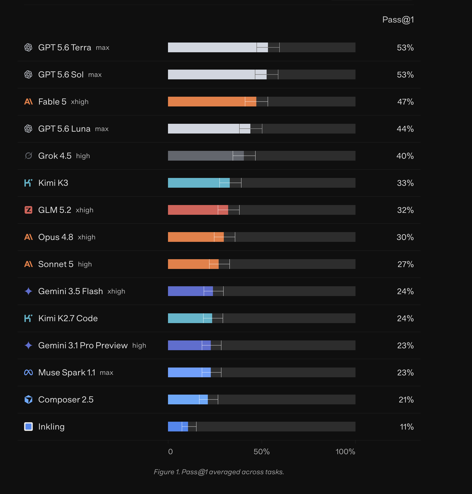
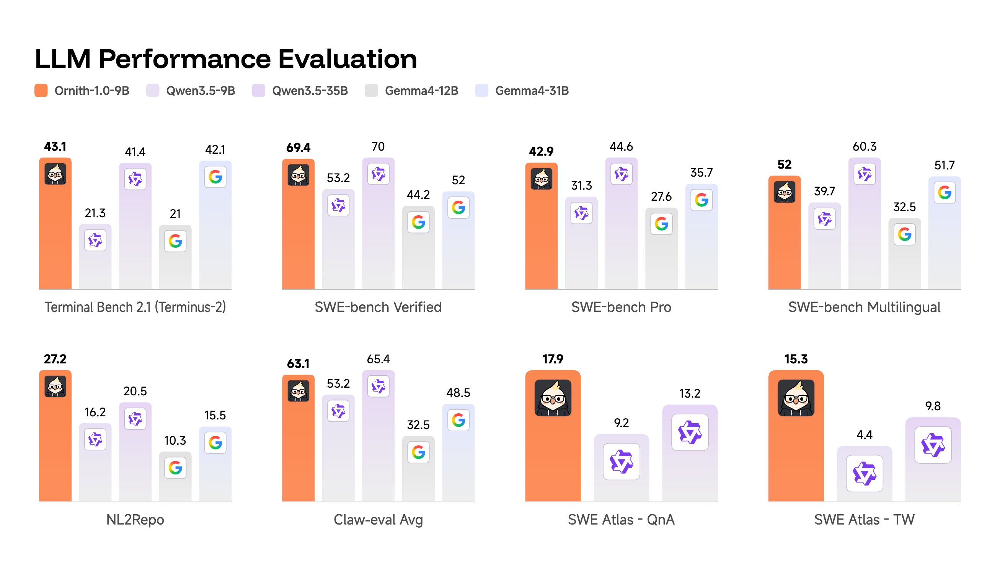
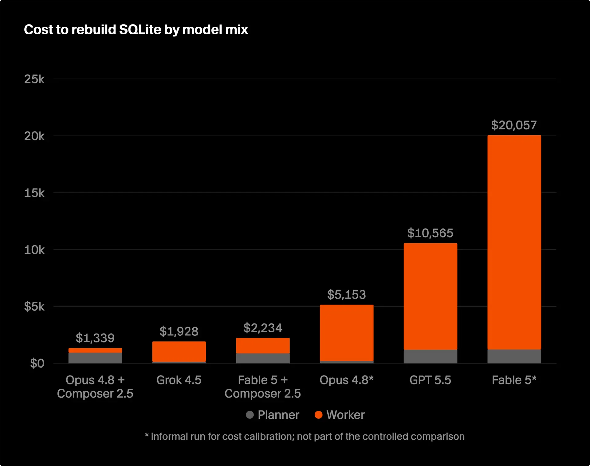
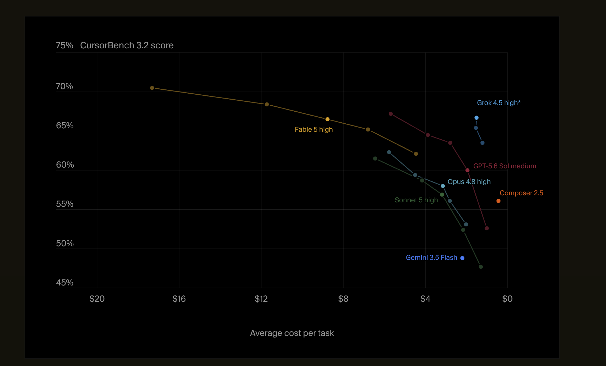

# 真实图表对照——四张报告图用候选语法怎么配

[Library 举例](library.md)从 niceeval 自己的场景出发对比现状与候选写法;这篇反向检验:拿四张真实世界的 eval 报告图(模型排行、多题集面板、成本构成、成本-质量前沿),逐张拆出**结构要素**,给出[候选 A](README.md#候选契约) 的等价写法,并标出现状与候选都还配不出来的缺口。对照只看结构——柱怎么排、哪里有误差线、什么和什么画在同一张画布;配色、字体、圆角这类样式不在对照范围,结构等价之后样式由主题层收敛。

写法沿用[组件对照](component-mapping.md)的命名与[指标组件](../../feature/reports/library/metric-views.md)的示例指标(`endToEndPassRate`、`costUSD`);对照中出现、候选契约此前没有登记的能力(`ErrorBar`、`stack`、单维排行形态)在文末[缺口清单](#缺口清单)汇总。

## 图 1——单指标排行条形与置信区间



**结构要素:** 一个维度(模型)按单一指标降序排行,每个维度值一根横向条;条上叠置信区间须线;行尾数值标签;行首维度值标签。

**现状:** 配不出来。`MetricBars` 的契约是 `rows × columns` 二维矩阵,没有「单指标按一个维度排行」的形态;最近的等价物是 `MetricTable`——排序、数值都有,但没有条形与置信区间。

**候选写法:**

```tsx
<MetricBars rows="agent" cell={endToEndPassRate} sort={endToEndPassRate}>
  <ErrorBar />
</MetricBars>
```

三个前提都是候选契约需要补的能力:

- **单维排行形态**:`MetricBars` 省略 `columns` 时退化为「一个维度值一根条」;`sort` 沿用 [`MetricTable.sort`](../../feature/reports/library/metric-views.md#metrictable) 的语义——必须是声明了 `better` 的同一个 Metric 实例,方向由 `better` 决定。
- **`ErrorBar` 子组件**:每个聚合值背后本来就有 attempt 级样本证据(`samples`/`refs`),置信区间从已有证据可算,作者不用自备误差值——与 recharts 同名但取数方式改造,判定见[组件对照](component-mapping.md#改名或不借用概念对不上-niceeval-的-metric--dimension-模型)。
- 行尾数值标签不需要子组件:text 面本来就以数字呈现,web 面把它作为条形的默认呈现即可。

## 图 2——多题集小面板



**结构要素:** 同一组维度值(模型)在多个题集上各成一块小面板;面板内条形 + 顶部数值;某一个维度值(自家模型)在所有面板中统一强调;全部面板共享一份图例。

**现状:** 面板拼排本身可配——`Grid` + 每题集一个 `MetricBars`(`evals` 前缀过滤),正是「多图并列」的既有组合方式。配不出来的是:单个维度值的视觉强调,以及跨面板统一的 series 声明与图例。

**候选写法:**

```tsx
<Grid columns={4}>
  <MetricBars evals="terminal-bench/" rows="agent" cell={endToEndPassRate}>
    <ChartSeries by="agent" />
    <ChartSeries value="ornith-9b" emphasis />
  </MetricBars>
  <MetricBars evals="swe-verified/" rows="agent" cell={endToEndPassRate}>
    <ChartSeries by="agent" />
    <ChartSeries value="ornith-9b" emphasis />
  </MetricBars>
  {/* …其余题集同形 */}
</Grid>
```

两点说明:

- 单维排行形态下,条的维度就是 series 维度,「强调一个值」正是 `by` 兜底展开 + `value` 显式覆盖的混用——README [待裁决的分歧](README.md#待裁决的分歧)里「合并算法未定案」那条在这张图上有了真实用例,不再是假设性问题。`emphasis` 是 `value` 形态携带专属呈现覆盖([Library 场景 2](library.md#场景-2逐-series-单独定制视觉现状做不到) 同一机制)的一个例子,具体呈现由主题决定。
- 每块面板要重复一遍相同的 `ChartSeries` 声明,八块面板就是八遍——「跨面板共享 series 声明与图例」在候选里没有对应物;要不要为此开 facet 容器(一次声明,按题集展开成面板),进[缺口清单](#缺口清单)。

## 图 3——成本构成堆叠条形



**结构要素:** 每个配置(模型组合)一根柱;柱内按成本构成堆叠——两段各是一个指标;柱顶显示堆叠总值;图例标构成;图底脚注说明口径。

**现状:** 配不出来,而且缺两层:`MetricBars` 的 `cell` 是单指标,没有堆叠;把两个指标画进同一根柱正是 `MetricComposed` 这个候选新容器的领地。

**候选写法:**

```tsx
// plannerCostUSD / workerCostUSD 是作者自定义的两个成本构成指标
<MetricComposed x="experiment">
  <ChartSeries as="bar" metric={plannerCostUSD} stack="cost" />
  <ChartSeries as="bar" metric={workerCostUSD} stack="cost" />
</MetricComposed>
```

`stack` 是 recharts `stackId` 的对应物:同容器内 `stack` 值相同的 series 堆进同一根柱,不同值各成堆——登记见[组件对照](component-mapping.md#改名或不借用概念对不上-niceeval-的-metric--dimension-模型)。柱顶总值标签是堆叠**和**,不属于任何单个 series,归容器 prop 还是归堆,候选没有答案,进[缺口清单](#缺口清单)。脚注与图题属排版层(`Col` + 文本),不进图表契约。

## 图 4——成本-质量前沿散点



**结构要素:** 点=一次运行配置,series=模型;series 内沿成本轴连成前沿曲线;x 是 `better: "lower"` 的成本轴、反向渲染(便宜在右,「越靠右上越好」);多点 series 与单点 series 混在同图;series 名直接标在线端,不设集中图例。

**现状:** 几乎全覆盖,一行现状语法就是这张图:

```tsx
<MetricScatter points="experiment" series="agent" connect x={costUSD} y={endToEndPassRate} />
```

`connect` 按 series 沿 x 升序连线 ✓;`better` 感知的轴反向 ✓(图里 $20 → $0 正是成本轴反向);单点 series 契约明文处理(无箭头无摘要)✓;点的直接标签 ✓。唯一差距是「series 名标在线端而非图例」——呈现细节,不是结构缺口。

**结论:** 四张图里结构最复杂的一张,反而是现状契约覆盖最好的——佐证 [Library 场景 5](library.md#场景-5metricscatter不提案子组件化)「`MetricScatter` 不子组件化」的判断:概念数量固定的图,扁平 props 已经是更短的表达。

## 缺口清单

对照四张图,候选契约(连同现状)缺的结构能力分两组:

**判定为必须、应并入候选 A 的**(没有它们,图 1、图 3 的形态配不出来):

- `MetricBars` 单维排行形态:`columns` 可省,`sort` 沿用 `MetricTable` 的 `better` 语义——图 1。
- `ErrorBar` 误差线子组件:evals 天然多 attempt、多样本,置信区间是这个领域比通用图表库更刚需的能力——图 1。
- `ChartSeries` 的 `stack`(recharts `stackId` 对应物)——图 3。

**新的待裁决点**(诉求真实、方案未定,已并入 [README 待裁决](README.md#待裁决的分歧)):

- 跨面板共享 series 声明与图例:开 facet 容器(一次声明、按题集/维度展开成面板)还是接受逐面板重复声明——图 2。
- 堆叠总值标签归容器 prop 还是归堆——图 3。
- 逐值强调(`emphasis` 一类呈现覆盖)依赖 `by` + `value` 的合并算法,与 README 既有待裁决同条——图 2 是它的真实用例。

## 相关阅读

- [图表组件的声明式子组件语法](README.md) —— 问题陈述、recharts 模型、兼容性分析与候选契约全文。
- [组件对照](component-mapping.md) —— 每个 recharts 组件的去向;`ErrorBar`、`stack` 的判定登记在此。
- [Library 举例](library.md) —— 从 niceeval 场景出发的现状 vs 候选对比,与本页互补。
- [指标组件](../../feature/reports/library/metric-views.md) —— 现状组件的完整 props 契约。
